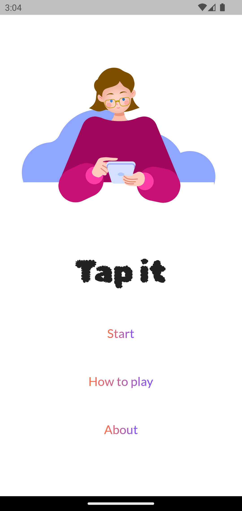

# tapit

A casual game made with Flutter.

### Screenshots

<table>
  <tr>
    <td align="center">Home</td>
    <td align="center">Game Screen</td>
    <td align="center">Winner Dialog</td>
  </tr>
  <tr>
    <td align="center"></td>
    <td align="center"></td>
    <td align="center"></td>
    
  </tr>
</table>
