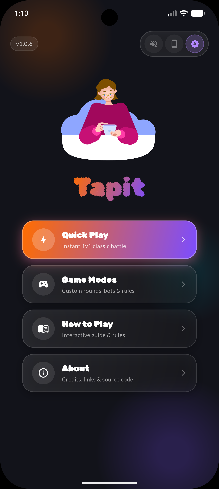
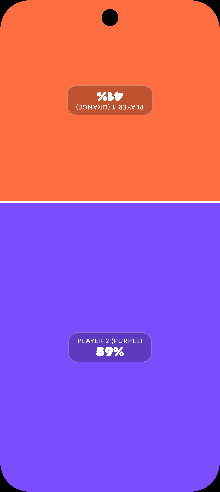
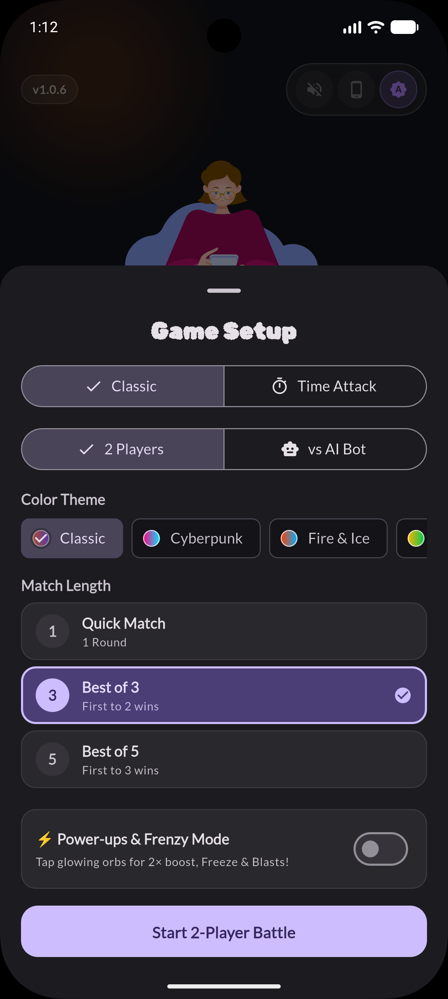

<div align="center">
  
  <h1>Tapit</h1>
  <p>A casual finger battle game made with Flutter.</p>

  <p>
    <a href='https://apps.apple.com/us/app/tapit-2-player-battle/id6801258455'>
      
    </a>
    <span>&nbsp;&nbsp;</span>
    <a href='https://play.google.com/store/apps/details?id=com.rejie.tapit&pcampaignid=pcampaignidMKT-Other-global-all-co-prtnr-py-PartBadge-Mar2515-1'>
      
    </a>
  </p>


### Screenshots
</div>

<table align="center">
  <tr>
    <td align="center">Home</td>
    <td align="center">Game Screen</td>
    <td align="center">Winner Dialog</td>
    <td align="center">Game Modes</td>
  </tr>
  <tr>
    <td align="center"></td>
    <td align="center"></td>
    <td align="center"></td>
    <td align="center"></td>
    
  </tr>
</table>

### Other Info

#### Flutter Info

```
Doctor summary (to see all details, run flutter doctor -v):
[✓] Flutter (Channel stable, 3.41.9, on macOS 26.6.1 25G76 darwin-arm64, locale en-IN)
[✓] Android toolchain - develop for Android devices (Android SDK version 36.1.0)
[✓] Xcode - develop for iOS and macOS (Xcode 26.0)
[✓] Chrome - develop for the web
[✓] Connected device (2 available)
[✓] Network resources

• No issues found!
```